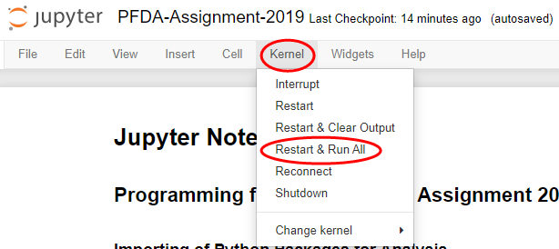
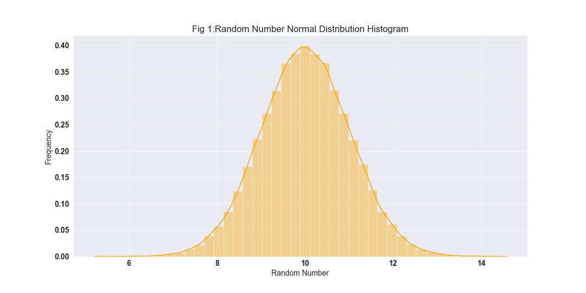
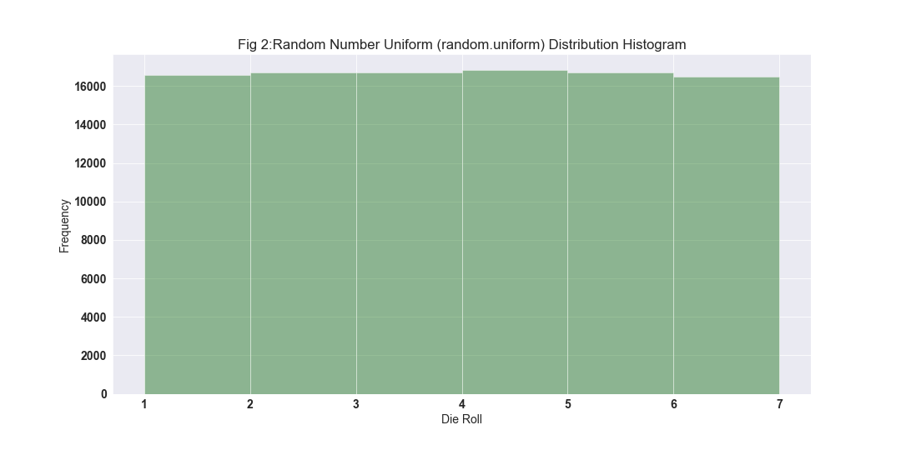
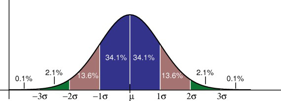
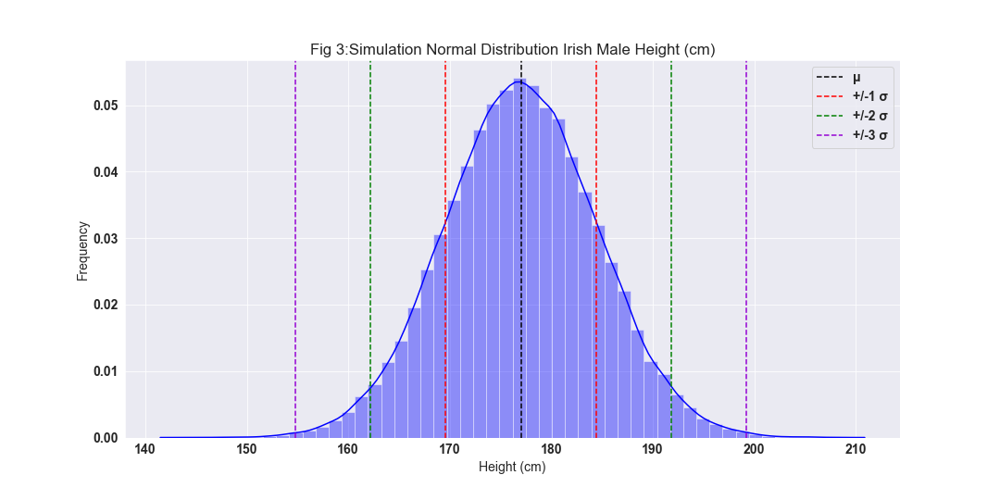

# PFDA-Assignment-2019
Git repository for Assignment 2019 for module Programming for Data Analysis, investigation in Numpy random number generator. References for Readme.md will be found at the end of the document, references on any code being used will all be referenced as they are used within the Jupyter Notebook.

## 1. Running the Code
1. Click this [link](https://github.com/Dowline1/PFDA-Assignment-2019) for my Github repository.
2. Click the download button to save a copy of the repository on your machine.
3. Make sure you have Python installed including Jupyter, if you require installation please folllow instructions in this [link](https://www.anaconda.com/distribution/) to download Python via Anaconda.
4. Use your command line such as CMDER to navigate to the folder housing the Git repository, download for CMDER found via this [link](https://cmder.net/).
5. Once in the folder type the command "Jupyter Notebook" and clcik enter.
6. This will open a Jupyter Notebook in your default web browser, click on the file "PFDA-Assignment-2019.ipynb".
7. Once in the Jupyter Notebook itself click on Kernel then Restart And Run All as per **image below**, this will run the code and generate all graphs.

## 2. Purpose of Package

### Purpose
The Numpy Random module is a number generator that can be used in Python to generate random numbers to be used in simulations in data analysis. These random numbers are generated in numpy by using the Mersenne Twister algorithm to generate the pseudo random numbers. In order to make the analysis repeatable and so that the same random numbers are generated in the Jupyter Notebook accompanying this readme file I will predefine the seed to **35**. If the seed was not defined initially numpy would automatically define a new seed value each time the code was re-run based on the system's random number generator device or the machines clock.

### History of Random Numbers
Statistician Francis Galton wrote in his publicaiton of Nature back in the 1890's that “As an instrument for selecting at random, I have found nothing superior to dice,”. Having the ability to on demand create numbers that are distributed in a desired fashion would reduce the time taken up by sampling as you could generate your own with the click of a button. The kind of number generation required to lend itself to more complex statistical analysis for example efficacy of a drug to treat a certain indication or determining the clinical trial size to determine this efficacy could not be generated from a simple roll of the dice unfortunately.

Post Francis Galton's publicaiton on the humble dice however in the mid 1940's the world took a step closer to modern times afirming that more random numbers where required that as mentioned already that the humble dice could not generate. RAND corporation came about with it's machine of the future the random pulse generator which was run for a period of time with results published in there book titled "A Million Random Digits with 100,000 Normal Deviates". What would now seem like a very strange undertaking was back then considered a breakthrough as for the first time there was a sequesnce of high quality random numbers to draw upon for those in need of such.

The Ferranti MK 1 was the first real computer that came pre-built with a random number instruction that generated 20 random bits at a time using electrical noise. This feature was implemented and designed by Alan Turing. The instructions however infuriated programmers at the time as it created to much uncertainty as it was impossible to test with programs as the numbers generated could no create data that demonstrated repeatability.

### Mersenne Twister Algorithm

### Pseudorandom Numbers

## 3a. Use of Simple Random Data Functions

Random Numbers are generally reffered to in field of staistics whereby they are utilised as a comparisson sample on a general study sample. A feature of random numbers that most individuals may not be aware of is that they need to have certain characteristics in order to be used correctly. These properties include the distribution of the numbers, as once there is an understanding of how the numbers are distributed for example a normal distribution, we can then use this understanding to generate our random numbers to aid in the study we are undertaking.

In this example as reffered to below in the references section the author refers to the life time of tube lights which in itself possess a Gaussian property (symmetric bell shape curve distribution) allowing the funciton to be used to represent the probability density of a normally distributed random variable. Knowing that the life time of these bulbs is normally distributed we can generate our random numbers with a normal distribution to be used as sample data for the study for a sufficiently size sample of say 1,000 bulbs.

The sample data can then be used as a simulation of the data to help determine many charteristics of the life time of the bulbs such as average life time and so on and so fortht that can be used in say the marketing of the bulbs for sale without the cost of using and testing actual bulbs in the data gathering phase of the study. This particular method of analysis is known as the Monte Carlo Method coined by John Von Newman in the 1940's.

There are several different types of variable distribution, in this assignment I will try to explain and represent 5 different kinds of variable distributions and there random number generation using Numpy's .random function.

The Random functions in Numpy can be used to generate such sample data to be used in simulations as described above, figure 1 below shows a plot of 100,000 random numbers generated using the randn function in Numby generating an array of numbers that are normally distributed around a predefined mean (in this example 10). For a real world scenario this method could be used to simulate the life time of tube lights and the mean can be adjusted to the relevant sampled mean to create a meaningful plot of the distribution.

## 3b. Use of Permutations Functions

Complete as per analysis from Jupyter Notebook

## 4. Distributions

### Uniform Distribution

The uniform distribution is called such as the probability for any of the outcomes to occur are the same, because of this even distribution of possibility a uniformally distributed dataset does not have a mode as the values are all equally common. This equal distribution of values results in a rectangular shaped plot when rendered as a histogram removing the need for a KDE line.

There are two different types of uniform distribution, discrete where a 6 sided die can land on the numbers 1 to 6 included but numbers like 1.5 or 3.7 are not possible, continuous where between the numbers 1 and 6 there are infinite number of points between them as we move the decimal place. 

Figure 2 below shows a simulation of the distribution of results of a six sided die rolled 100,000 times as calculated using the accompanying jupyter notebook, it shows the equal likeliness of each value of the die resulting from the throw. I found it an interesting thought to calculate the mean of 4 which when simply calculated without any visualisation of the complete dataset may lead some to assume that 4 is the most likely result to occur, but is in actual fact simply the centre value of the dataset and highlights the importance of plotting datasets to understand the full picture. 

### Normal Distribution

A normal distribution also commonly known as the bell shaped curve occurs naturally in many instances in the real world, the highest peak of the curve indicates the mean of the dataset with 50% of the data occuring either side of the mean. The below image shows the percentage distribution of data accross a normal distribution as per the emirical rule, the rule shows that 68% of the data falls within one standard deviation, 95% within two standard deviations and 99.7% within three standard deviations.

A smaller standard deviation in a dataset indicates a tighter spread around the mean of the data resulting in a taller peak in the curve. In a normal distribution the mean, mode and median are all equal to each other with the total area beneath the curve being equal to 1.

The histogram in figure 3 shows a real world simulation of a normally distributed dataset generated using the random.normal function to simulate results as specified in reference Irish male Avg Height and SD below, with mean = 177cm and sd = 7.42cm which are the results for adult Irish Males.

Also included in the histogram are dotted vertical lines along the x-axis which indicate standard deviations to the right and left of the mean. As per the emperial rule we can see that 68% of the populations height lies between 169.58cm and 184.42cm or one standard deviation. From using this graph Irish Males can determine what quartile of the population does there height lie, specifically my height at 175.26cm resides in the 40.73% percentile of the population.

## 5. Use of Seeds

### Seeds in Random Numbers

## Conclusion

## References
- History of Random Numbers [link](https://www.freecodecamp.org/news/a-brief-history-of-random-numbers-9498737f5b6c/)
- Random Number Applications [link](https://analyticstraining.com/random-numbers-applications/)
- Gaussian Property [link](http://users.isr.ist.utl.pt/~mir/pub/probability.pdf)
- Numpy.Random Package Documentation [link](https://docs.scipy.org/doc/numpy-1.16.0/reference/routines.random.html)
- Numpy.Random what does it do [link](https://subscription.packtpub.com/book/big_data_and_business_intelligence/9781785285110/2/ch02lvl1sec16/numpy-random-numbers#targetText=NumPy%20random%20numbers,Twister,%20to%20generate%20pseudorandom%20numbers.)
- Permutations Definition [link](https://stattrek.com/statistics/dictionary.aspx?definition=permutation)
- Why Shuffle Data [link](https://datascience.stackexchange.com/questions/24511/why-should-the-data-be-shuffled-for-machine-learning-tasks)
- Difference Shuffle and Permutation [link](https://stackoverflow.com/questions/15474159/shuffle-vs-permute-numpy)
- Types of Distribution [link](https://www.datacamp.com/community/tutorials/probability-distributions-pythonju)
- What is a Uniform Distribution [link](https://www.thoughtco.com/uniform-distribution-3126573)
- Unifrom Distribution Investopedia [link](https://www.investopedia.com/terms/u/uniform-distribution.asp)
- Normal Distribution Notes [link](https://www.statisticshowto.datasciencecentral.com/probability-and-statistics/normal-distributions/)
- Height - Normal Distribution Example [link](https://www.johndcook.com/blog/2008/07/20/why-heights-are-normally-distributed/#targetText=The%20canonical%20example%20of%20the,a%20normal%20(Gaussian)%20distribution.&targetText=The%20normal%20distribution%20is%20a,of%20heights%20for%20some%20purposes.)
- Irish Male Avg Height and SD [link](https://tall.life/height-percentile-calculator-age-country/)