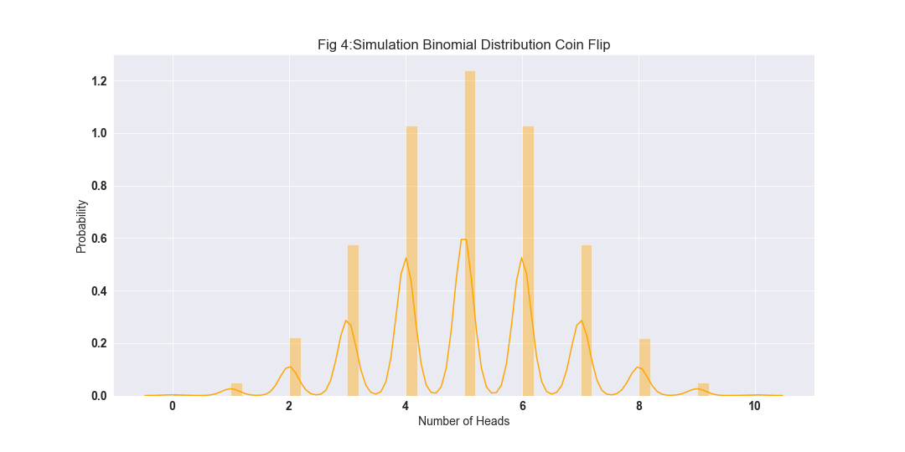
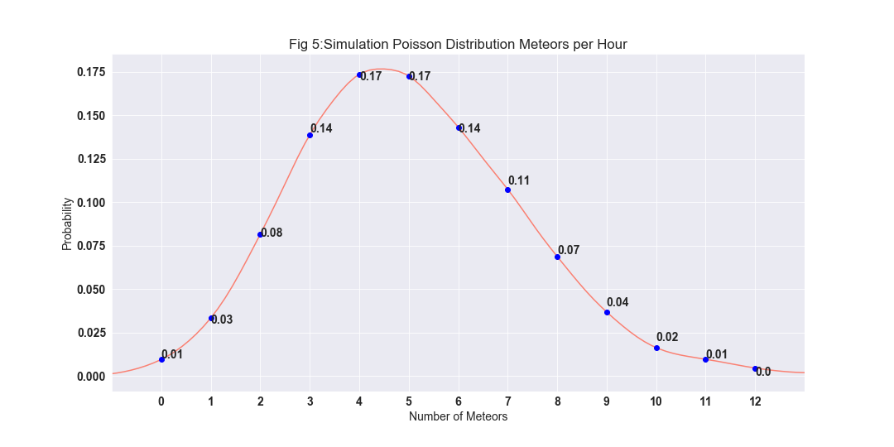
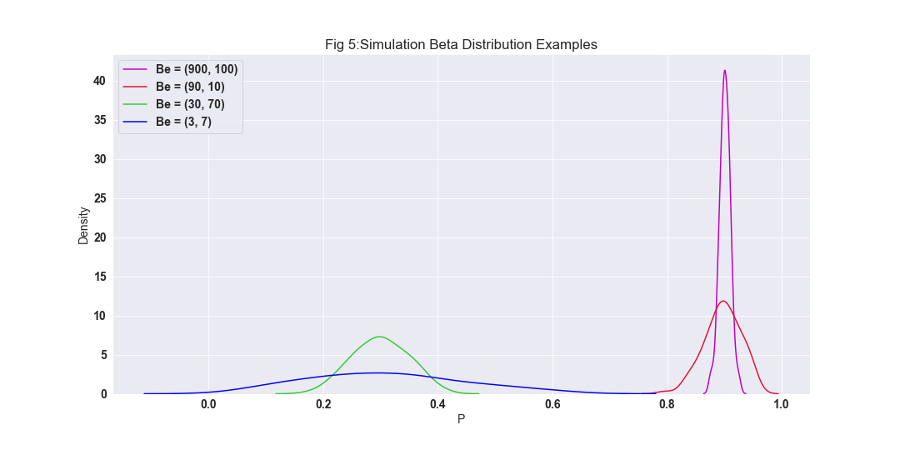

# PFDA-Assignment-2019
Git repository for Assignment 2019 for module Programming for Data Analysis, investigation into Numpy random number generator. References for Readme.md will be found at the end of the document, references on any code being used will all be referenced as they are used within the Jupyter Notebook.

## 1. Running the Code
1. Click this [link](https://github.com/Dowline1/PFDA-Assignment-2019) for my Github repository.
2. Click the download button to save a copy of the repository on your machine.
3. Make sure you have Python installed including Jupyter, if you require installation please folllow instructions in this [link](https://www.anaconda.com/distribution/) to download Python via Anaconda.
4. Use your command line such as CMDER to navigate to the folder housing the Git repository, download for CMDER found via this [link](https://cmder.net/).
5. Once in the folder type the command "Jupyter Notebook" and clcik enter.
6. This will open a Jupyter Notebook in your default web browser, click on the file "PFDA-Assignment-2019.ipynb".
7. Once in the Jupyter Notebook itself click on Kernel then Restart And Run All as per **image below**, this will run the code and generate all graphs.

## 2. Purpose of Package

### Purpose
The Numpy Random module is a number generator that can be used in Python to generate random numbers to be used in simulations in data analysis. These random numbers are generated in numpy by using the Mersenne Twister algorithm to generate the pseudo random numbers. In order to make the analysis repeatable and so that the same random numbers are generated in the Jupyter Notebook accompanying this readme file I will predefine the seed to **35**. If the seed was not defined initially numpy would automatically define a new seed value each time the code was re-run based on the system's random number generator device or the machines clock.

### History of Random Numbers
Statistician Francis Galton wrote in his publication in Nature back in the 1890's that “As an instrument for selecting at random, I have found nothing superior to dice,”. Having the ability to on demand create numbers that are distributed in a desired fashion would reduce the time taken up by sampling as you could generate your own with the click of a button. The kind of number generation required to lend itself to more complex statistical analysis for example efficacy of a drug to treat a certain indication or determining the clinical trial size to determine this efficacy could not be generated from a simple roll of the dice unfortunately.

Post Francis Galton's publicaiton on the humble dice however in the mid 1940's the world took a step closer to modern times afirming that more random numbers where required than as mentioned already the humble dice could generate. RAND corporation came about with it's machine of the future the random pulse generator which was run for a period of time with results published in there book titled "A Million Random Digits with 100,000 Normal Deviates". What would now seem like a very strange undertaking was back then considered a breakthrough as for the first time there was a sequesnce of high quality random numbers to draw upon for those in need of such.

The Ferranti MK 1 was the first real computer that came pre-built with a random number instruction that generated 20 random bits at a time using electrical noise. This feature was implemented and designed by Alan Turing. The instructions however infuriated programmers at the time as it created to much uncertainty as it was impossible to test with programs as the numbers generated could no create data that demonstrated repeatability.

## 3a. Use of Simple Random Data Functions

Random Numbers are generally reffered to in the field of staistics whereby they are utilised as a comparisson sample on a general study sample. A feature of random numbers that most individuals may not be aware of is that they need to have certain characteristics in order to be used correctly. These properties include the distribution of the numbers, as once there is an understanding of how the numbers are distributed for example a normal distribution, we can then use this understanding to generate our random numbers to aid in the study we are undertaking.

In this example as reffered to below in the references section the author refers to the life time of tube lights which in itself possess a Gaussian property (symmetric bell shape curve distribution) allowing the funciton to be used to represent the probability density of a normally distributed random variable. Knowing that the life time of these bulbs is normally distributed we can generate our random numbers with a normal distribution to be used as sample data for the study for a sufficiently size sample of say 1,000 bulbs.

The sample data can then be used as a simulation of the data to help determine many charteristics of the life time of the bulbs such as average life time and so on and so fortht that can be used in say the marketing of the bulbs for sale without the cost of using and testing actual bulbs in the data gathering phase of the study. This particular method of analysis is known as the Monte Carlo Method coined by John Von Newman in the 1940's.

There are several different types of variable distribution, in this assignment I will try to explain and represent 5 different kinds of variable distributions and there random number generation using Numpy's .random function.

The Random functions in Numpy can be used to generate such sample data to be used in simulations as described above, figure 1 below shows a plot of 100,000 random numbers generated using the randn function in Numby generating an array of numbers that are normally distributed around a predefined mean (in this example 10). For a real world scenario this method could be used to simulate the life time of tube lights and the mean can be adjusted to the relevant sampled mean to create a meaningful plot of the distribution.

## 3b. Use of Permutations Functions

Please refer to Shuffle Function, Permutation Function Array and Permutation Function Integer headers within the Jupyter Notebook which best explains these functions along with examples.

## 4. Distributions

### Uniform Distribution

The uniform distribution is called such as the probability for any of the outcomes to occur are the same, because of this even distribution of possibility a uniformally distributed dataset does not have a mode as the values are all equally common. This equal distribution of values results in a rectangular shaped plot when rendered as a histogram removing the need for a KDE line.

There are two different types of uniform distribution, discrete where a 6 sided die can land on the numbers 1 to 6 included but numbers like 1.5 or 3.7 are not possible, continuous where between the numbers 1 and 6 there are infinite number of points between them as we move the decimal place. 

Figure 2 below shows a simulation of the distribution of results of a six sided die rolled 100,000 times as calculated using the accompanying jupyter notebook, it shows the equal likeliness of each value of the die resulting from the throw. I found it an interesting thought to calculate the mean of 4 which when simply calculated without any visualisation of the complete dataset may lead some to assume that 4 is the most likely result to occur, but is in actual fact simply the centre value of the dataset and highlights the importance of plotting datasets to understand the full picture. 

### Normal Distribution

A normal distribution also commonly known as the bell shaped curve occurs naturally in many instances in the real world, the highest peak of the curve indicates the mean of the dataset with 50% of the data occuring either side of the mean. The below image shows the percentage distribution of data accross a normal distribution as per the emirical rule, the rule shows that 68% of the data falls within one standard deviation, 95% within two standard deviations and 99.7% within three standard deviations.

A smaller standard deviation in a dataset indicates a tighter spread around the mean of the data resulting in a taller peak in the curve. In a normal distribution the mean, mode and median are all equal to each other with the total area beneath the curve being equal to 1.

The histogram in figure 3 shows a real world simulation of a normally distributed dataset generated using the random.normal function to simulate results as specified in reference Irish male Avg Height and SD below, with mean = 177cm and sd = 7.42cm which are the results for adult Irish Males.

Also included in the histogram are dotted vertical lines along the x-axis which indicate standard deviations to the right and left of the mean. As per the emperial rule we can see that 68% of the populations height lies between 169.58cm and 184.42cm or one standard deviation. From using this graph Irish Males can determine what quartile of the population does there height lie, specifically my height at 175.26cm resides in the 40.73% percentile of the population.

### Binomial Distribution

Binomial distribution is a probability distribution that looks at the likelihood of a value occuring, in it's simplest form it can be explained by evaluating the outcome of a coin flip but other more complex examples can be used like rolling a die or likelihood of a card appearing from a shuffled deck. To keep things simple I used the example of a coin flip and generated an array of random numbers using the random.binomial function in numpy generating figure 4 below with bars representing the number of times head was flipped in a series of 10 flips with the higher the peak the higher the probability.

For my parameters I evaluated the frequency of heads occuring in a series of 10 coin flips and then repeated this 100,000 times to generate my sample data to be used in my simulations. As there are only 2 sides to a coin the probability of either occuring is 50% so the likelihood is interchangeable between heads and tails being flipped. As we get closer to the thoretical number of heads occuring being 5 as 50% of 10 flips is 5 the peaks get higher. This data can be further used to predict what the likelihood of exactly x number heads occuring.

Using my randomly generated array I researched the documentation aswell as other sources so that I could determine from my dataset what the likelihood would be that when a coin was flipped 10 times of exactly 5 heads resulting also taking into account repeating the experiment 100,000 times. The result was that I was able to determine that the likelihood of this occuring was 24.77%, the code can be adjusted to calculate the likelihood of an other number of heads occuring easily by changing the variables which I have highlighted in the jupyter notebook.

The code can be further altered easily to evaluate any other scenario which results in a Yes or No response such as the roll of a die resulting in a 1 or 5 for example by changing the probability parameter to 33.33 as there is a 1 in 3 chance of this occuring. 

The binomial distribution is a discrete distribution that is used in statistics as opposed to a continious distribution as it only counts 2 states with 1 typically being sucess or 0 meaning a failure given a certain number of attempts and then repeated again a number of times whereby all that is needed to evaluate is the probability of the result and the number of attempts making it a very useful and common form of distribution. Real world examples that I can think of could be the number of clinical trials to be completed in order to determine to a certain level of confidence that the efficacy of a drug is beneficial to a cohort of patients.

### Poisson Distribution

The Poisson Distribution is a discrete distribution that is used to demonstrate the nunmber of times that an event is likely to occur with a specified amount of time which occur at a constant rate named after the mathematician Siméon Denis Poisson. In the real world applicaiton of Poisson Distributions in simulations can be used to estimate sales based on previous lambda values to represent the variance allowing for management to determine optimal staff numbers to deal with the demand.

In my below KDE plot I simulated data using the random.poisson function to try and replicate the visualisation that was discussed in my references on the number of shooting stars in an hour period which follows a poisson distribution. In the article the author discusses watching shooting stars as a child when he was told that around 5 shooting stars were expected to occur within a 1 hour period, the 5 would become my lambda value to represent 5 shooting stars within an hour period with the number of observations set to 1,000.

I went on in my analysis to include marker points on my plot to represent the statistical possibility of each number of meteorite observations to occur withing an hour period with labels of the possibility in decimal. The plot shows the probability of our lambda value of 5 occuring as being 17% and allows for additional querying of the data like the probability of 5 or more observations by simply adding the percentage from and to the points i.e. 5 or more observations equals56% probability.

Using the example of shooting star observations we can then utilise the Poisson Distribution to make predictions on the likely number of shooting stars that we will see on subsequent nights or maybe the number of flu vaccines that we may sell along with combining this with data we have on the seasonality of the flu virus and when best to have our manufacturng campaigns to meet the demand. Applications I understand from the distribution are very powerful and could be well utilised in a demand forecasting nature using the model to better place a business to take advantage of the oppurtunities of sales determined from Poisson predictions.

### Beta Distribution

The Beta Distribution is a continious distribution that has 2 inputs required and is most widely used to determine uncertainty of the success of an experiment. The distribution itself lies on the interval (0, 1) and allow for generation of non-uniform distributions for the values that lie between 0 and 1. The two inputs or parameters required to generate the data in the random.beta function are (a, b) and determine the shape of the beta distribution generated.  

The below KDE plot uses the beta distributions generated from the random.beta function (4 in total) to plot the points so that the influence of the different parameters can be visualised. The mean of each of the beta distributions can be calculated by using the 2 parameters (a, b) used to generated the random numbers, with the formula μ= a/(a+b). As can be seen from the plot the standard deviation gets smaller the larger the values for a and b, represented by the height and width of the peak with smaller deviations being taller and narrower.

The relatively large parameters passed into the green plot of (30, 70) resemble closesly a normal distribution, however unlike the normal distribution the beta distribution is restricted to between 0 and 1.

## 5. Use of Seeds

### Pseudorandom Numbers

Pseudorandom numbers are approxamated random numbers that are generated by various different comupter softwares, a true random number is selected from a range of numbers with all the numbers in the range having both an equal and also unpredictable probability of being selected. Pseudorandom numbers rely on a seed to improve the randomness, these seeds are generally taken from the physical world such as the seconds of the current time on the system clock.

The process for selecting Pseudorandom numbers is not perfect and the period will repeat itself eventually allowing theoretically for the next number in the sequence to be predicted. If properly implemented pseduorandom numbers are generally random enough for most applications that use them. Hardware random number generators are capable of producing true random numbers, this is achieved with quite simple devices that sample statistically random noise signals like thermal noise that currently have no known pattern that is predictable. 

The Mersenne Twister algorithm  is currently the most popular method of generating pseudorandom numbers and is distributed widely in many of todays most common mathmatical software packages, it was developed in 1997 by Makoto Matsumoto and Takuji Nishimura in Hiroshima University. The algorithm was designed with the goal of imporving on the flaws of the generators that went before it, giving a far longer period (number of steps before repeating ~(2^19937)-1), very fast at generating with an efficient use of memory.

### Seeds in Random Numbers

A seed in terms of random numbers is the starting point from which a computer generates a random number sequence, the seed can be any number but is generally derived from the seconds on a computer's system clock. When generated in this way the counter for seconds has commenced from Unix time or January 1st 1970, this allows for a huge range of seeds in the region of 0 to +1Billion thus ensuring that the same random see is not used twice.

Setting a seed to a pre-determined number allows for the random numbers generated to be repeated as the starting point for the sequence will always be the same as the steps that the algorithm takes to generate the sequence although very complicated are the same each time allowing for us to predict each successive number and repeat any experimentation or analysis that we would like to replicate. 

The sequence of pseudorandom number will eventually repeat itself as it follows a pattern, it may take a very large number of successive numbers to be generated before arrivin back at the seed but once we do so we can predict from that point (when we arrive back at the seed) each successive pseudorandom number. This concept is quite interesting to me as I am sure that there are some security measures that use pseudorandom numbers in this way to safeguard our data, and it could be possible for the security to be breached. 

Although not 100% secure it is basically secure as the time it would take to figure out the numbers I am sure would outway the benefit as it would take so long, I think of this as a simple 4 digit combination lock it is not entirely secure as there are only 10,000 possible codes but the time taken to trial them all would make it unrealistic for it to be stollen in this way. This concept applies also to the random number generator just at a much larger scale.

## References
- History of Random Numbers [link](https://www.freecodecamp.org/news/a-brief-history-of-random-numbers-9498737f5b6c/)
- Random Number Applications [link](https://analyticstraining.com/random-numbers-applications/)
- Gaussian Property [link](http://users.isr.ist.utl.pt/~mir/pub/probability.pdf)
- Numpy.Random Package Documentation [link](https://docs.scipy.org/doc/numpy-1.16.0/reference/routines.random.html)
- Numpy.Random what does it do [link](https://subscription.packtpub.com/book/big_data_and_business_intelligence/9781785285110/2/ch02lvl1sec16/numpy-random-numbers#targetText=NumPy%20random%20numbers,Twister,%20to%20generate%20pseudorandom%20numbers.)
- Permutations Definition [link](https://stattrek.com/statistics/dictionary.aspx?definition=permutation)
- Why Shuffle Data [link](https://datascience.stackexchange.com/questions/24511/why-should-the-data-be-shuffled-for-machine-learning-tasks)
- Difference Shuffle and Permutation [link](https://stackoverflow.com/questions/15474159/shuffle-vs-permute-numpy)
- Types of Distribution [link](https://www.datacamp.com/community/tutorials/probability-distributions-pythonju)
- What is a Uniform Distribution [link](https://www.thoughtco.com/uniform-distribution-3126573)
- Unifrom Distribution Investopedia [link](https://www.investopedia.com/terms/u/uniform-distribution.asp)
- Normal Distribution Notes [link](https://www.statisticshowto.datasciencecentral.com/probability-and-statistics/normal-distributions/)
- Height - Normal Distribution Example [link](https://www.johndcook.com/blog/2008/07/20/why-heights-are-normally-distributed/#targetText=The%20canonical%20example%20of%20the,a%20normal%20(Gaussian)%20distribution.&targetText=The%20normal%20distribution%20is%20a,of%20heights%20for%20some%20purposes.)
- Irish Male Avg Height and SD [link](https://tall.life/height-percentile-calculator-age-country/)
- Binomial Distribution Information [link](https://www.statisticshowto.datasciencecentral.com/probability-and-statistics/binomial-theorem/binomial-distribution-formula/)
- Simulating Coin toss in Python [link](https://cmdlinetips.com/2018/12/simulating-coin-toss-experiment-with-binomial-random-numbers-using-numpy/)
- Common Data Science Distributions [link](https://www.analyticsvidhya.com/blog/2017/09/6-probability-distributions-data-science/)
- Poisson Distribution World Example [link](https://towardsdatascience.com/the-poisson-distribution-and-poisson-process-explained-4e2cb17d459)
- Mersenne Twister Article [link](https://www.sciencedirect.com/topics/computer-science/mersenne-twister)
- How does Mersenne's Twister work [link](https://www.cryptologie.net/article/331/how-does-the-mersennes-twister-work/)
- What is a Beta Distribution [link](https://www.statisticshowto.datasciencecentral.com/beta-distribution/)
- Beta Distribution with Examples [link](https://www.statlect.com/probability-distributions/beta-distribution)
- Beta Distribution Overview [link](https://stephens999.github.io/fiveMinuteStats/beta.html)
- Pseudorandom Numbers vs Random Numbers [link](https://simplicable.com/new/pseudorandom-vs-random)
- Seed Selection [link](https://www.statisticshowto.datasciencecentral.com/random-seed-definition/##targetText=A%20random%20seed%20is%20a,Henkemans%20%26%20Lee%2C%202001)